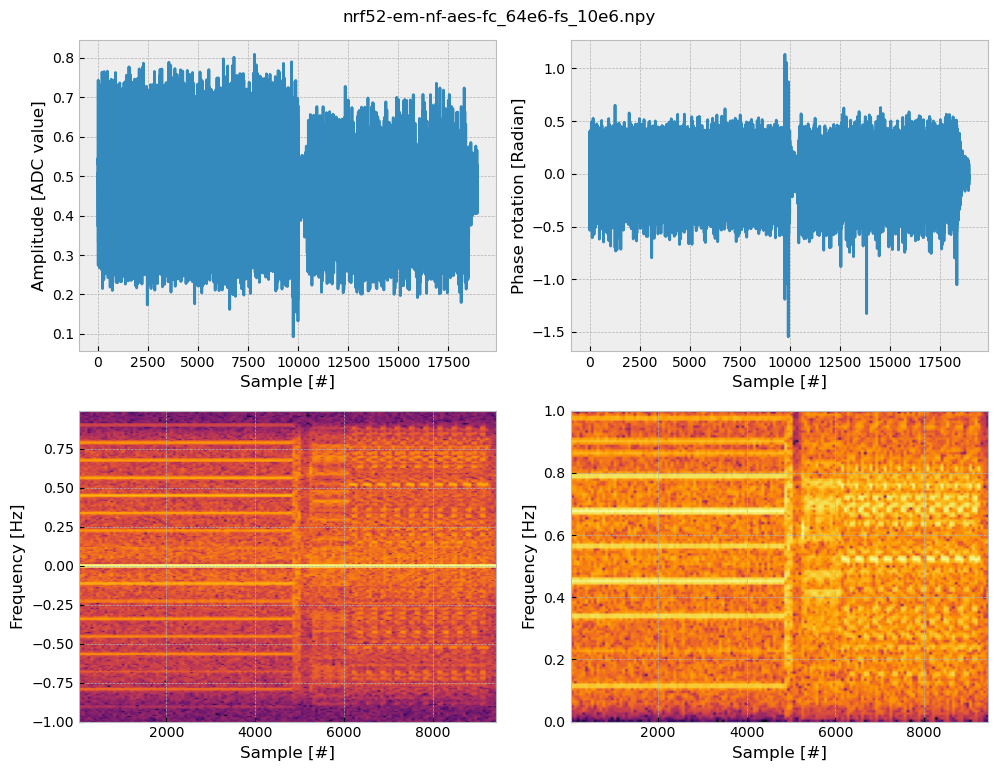

<h1 align="center">SoapyRX</h1>
<h4 align="center">An SDR receiver built on SoapySDR</h4>

The scope of this tool is to handle **signal acquisition** from a **Software-Defined Radio (SDR)**.
Using [SoapySDR](https://github.com/pothosware/SoapySDR/wiki) as backend, it supports every SDR supported by the latter -- as long as the corresponding module is installed.
Its output can later be used to create datasets of signals and perform pre-processing with other software.

<center></center>

# Features

- One-shot "**record-plot-cut-save**" cycle from the **command-line**
- **Server mode** controlled from a client (local socket)
- Multiple **synchronized SDRs** controlled in parallel
- Display basic **signal visualization** (amplitude, phase rotation, time-domain, frequency-domain)
- Perform per-signal **interactive operations** (*e.g.*, cutting)
- Use **complex numbers (I/Q)** for storage (`numpy.complex64`)
- **Live display** (buffered recording, like an oscilloscope, not like a spectrum analyzer)

# Supported devices

- [RTL-SDR](https://www.rtl-sdr.com/)
- [HackRF](https://greatscottgadgets.com/hackrf/one/)
- [USRP](https://www.ettus.com/product-categories/usrp-bus-series/)
- [SDRPlay](https://www.sdrplay.com/)
- [AirSpy](https://airspy.com/)

> [!NOTE]
> SoapyRX is an independent tool, initially developed for the [PhaseSCA](https://github.com/pierreay/phasesca.git) research project about electromagnetic side channel.

# Installation

## Dependencies

- Install [SoapySDR](https://github.com/pothosware/SoapySDR/wiki) and the module corresponding to the desired SDR using packages (refer to your distribution) or sources (refer to [Installation of SoapySDR from sources](#installation-of-soapysdr-from-sources)).

## SoapyRX

- Clone SoapyRX repository and install it using using [Pip](https://pypi.org/project/pip/):

```bash
git clone https://github.com/pierreay/soapyrx.git
cd soapyrx && pip install --user .
```

## Installation of SoapySDR from sources

> [!TIP]
> This section is NOT needed if you install SoapySDR using your package manager!

1. Install the required dependencies using your distribution package manager:
    - `cmake`
    - `g++`
    - `python3`
    - `numpy`
    - `dbg`
    - `swig`
    - `boost`
    - `boost-thread`

2. Get the source code and build:

```bash
cd /tmp && git clone https://github.com/pothosware/SoapySDR.git
mkdir SoapySDR/build build && cd SoapySDR/build
cmake .. && make -j4
```

3. Install and test if SoapySDR is installed correctly:

```bash
sudo make install && sudo ldconfig
SoapySDRUtil --info
```

4. We support the following modules:
    - [SoapyRTLSDR](https://github.com/pothosware/SoapyRTLSDR)
    - [SoapyHackRF](https://github.com/pothosware/SoapyHackRF.git)
    - [SoapyUHD](https://github.com/pothosware/SoapyUHD.git)
    - [SoapySDRPlay3](https://github.com/pothosware/SoapySDRPlay3)
    - [SoapyAirspy](https://github.com/pothosware/SoapyAirspy)

5. Select the module according to your SDR and ensure that the SDR driver is correctly installed on your system, independently of SoapySDR.

6. Then, get the source code and build, replacing `$MODULE_URL` and `$MODULE_NAME` accordingly:

```bash
cd /tmp && git clone $MODULE_URL
mkdir $MODULE_NAME/build && cd $MODULE_NAME/build
cmake .. && make
```

7. Install and test if SoapySDR is able to detect the USRP, replacing `$MODULE_DRIVER` by:
    - `rtlsdr` for RTL-SDR.
    - `hackrf` for SoapyHackRF.
    - `uhd` for SoapyUHD.
    - `sdrplay` for SoapySDRPlay3.
    - `airspy` for AirSpy.
    
```bash
sudo make install
SoapySDRUtil --probe="driver=$MODULE_DRIVER"
```
